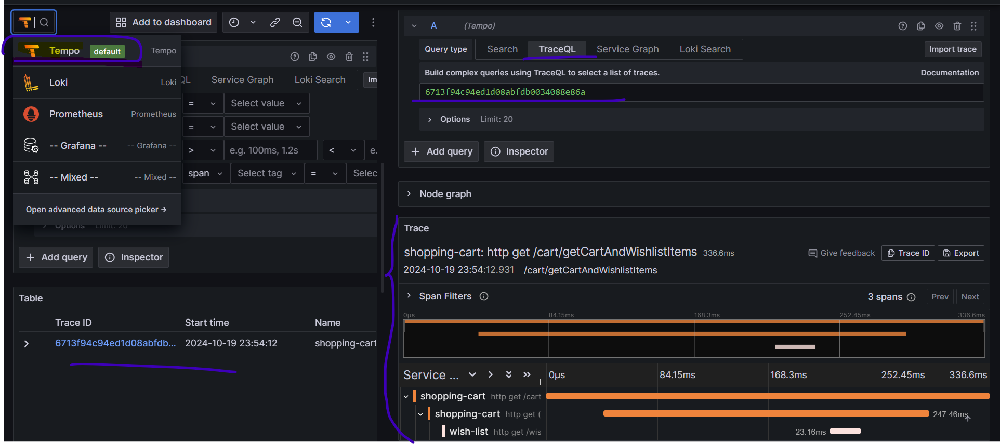

# sb-with-grafana-stack

It's a two module spring-boot project - shopping-cart & wish-list.
These modules are running in different ports - behaves like two different services.
shopping-cart service calls wish-list service. 
The objective of this project is to show how to use grafana stack in spring-boot projects.

## How to run
From Intellij, both the modules can be run together using the following commands:

1. _**./gradlew :wish-list:bootRun**_ 
2. _**./gradlew :shopping-cart:bootRun**_

## Docker
docker folder contains all necessary files needed to run grafana, loki, prometheus and tempo in docker container.
docker-compose is used to run these containers only.

## Example

## Note
1. To automatically propagate traces over the network, it is advised to use the auto-configured RestClient.Builder to construct the client. If the RestClient is created without using the auto-configured builders, automatic trace propagation may not work. Ref: https://docs.spring.io/spring-boot/reference/actuator/tracing.html#actuator.micrometer-tracing.propagating-traces

